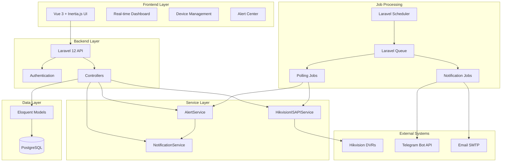
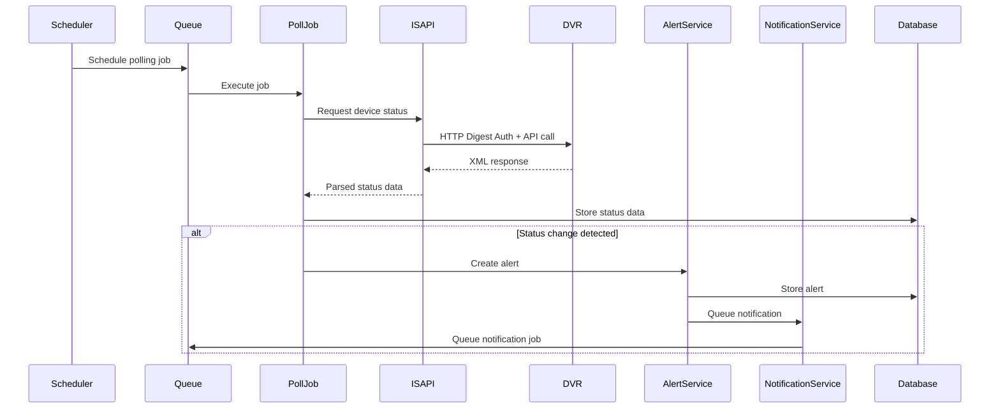

# Design Document: DVR Health Monitor System

## Overview

The DVR Health Monitor system is a comprehensive monitoring solution for Hikvision DVR systems built on Laravel 12 with Vue 3 frontend. The system provides real-time monitoring of channel status, storage health, and device connectivity through ISAPI integration, with intelligent alert management and multi-channel notifications.

### Key Design Principles

- **Separation of Concerns**: Clear separation between monitoring, alerting, and notification subsystems
- **Reliability**: Queue-based processing with retry mechanisms and graceful failure handling
- **Scalability**: Efficient polling schedules and connection pooling for multiple device monitoring
- **Security**: HTTP Digest Authentication for ISAPI communication and encrypted credential storage
- **User Experience**: Real-time dashboard with auto-refresh and intuitive management interfaces

### System Boundaries

**In Scope:**
- Real-time monitoring of Hikvision DVR systems via ISAPI
- Channel status, storage health, and device connectivity monitoring
- Alert generation, management, and notification delivery
- Web-based dashboard and management interfaces
- Queue-based job processing and scheduled polling

**Out of Scope:**
- Live video streaming or playback functionality
- DVR device configuration or control
- Video analytics or motion detection
- Mobile applications (web-responsive only)

## Architecture

### High-Level Architecture



### Component Architecture

#### Core Services

**HikvisionISAPIService**
- HTTP client with Digest Authentication
- XML response parsing and validation
- Connection pooling and timeout management
- Error handling and retry logic

**AlertService**
- Alert generation and lifecycle management
- Anti-spam logic with configurable intervals
- Alert severity classification and routing
- Alert acknowledgment and resolution tracking

**NotificationService**
- Multi-channel notification delivery (Telegram, Email)
- Retry policies and failure handling
- Notification template management
- Delivery status tracking and logging

#### Job Processing System

**Polling Jobs**
- `PollChannelStatusJob`: Channel monitoring every 1 minute
- `PollStorageStatusJob`: Storage monitoring every 5 minutes  
- `PollDeviceHealthJob`: Device connectivity every 2 minutes

**Notification Jobs**
- `NotifyAlertJob`: Queue-based notification delivery
- Retry mechanisms with exponential backoff
- Dead letter queue for failed notifications

## Components and Interfaces

### Service Interfaces

#### HikvisionISAPIService Interface

```php
interface HikvisionISAPIServiceInterface
{
    public function getChannelStatus(Device $device): ChannelStatusResponse;
    public function getStorageStatus(Device $device): StorageStatusResponse;
    public function getDeviceHealth(Device $device): DeviceHealthResponse;
    public function testConnection(Device $device): ConnectionTestResult;
}
```

#### AlertService Interface

```php
interface AlertServiceInterface
{
    public function createChannelAlert(DeviceChannel $channel, string $status): Alert;
    public function createStorageAlert(DeviceStorage $storage, string $health): Alert;
    public function createDeviceAlert(Device $device, string $status): Alert;
    public function resolveAlert(Alert $alert): bool;
    public function shouldNotify(Alert $alert): bool;
}
```

#### NotificationService Interface

```php
interface NotificationServiceInterface
{
    public function sendTelegramNotification(Alert $alert): NotificationResult;
    public function sendEmailNotification(Alert $alert): NotificationResult;
    public function queueNotification(Alert $alert): void;
}
```

### API Endpoints

#### Device Management API

```
GET    /api/devices                 - List all devices
POST   /api/devices                 - Create new device
GET    /api/devices/{id}            - Get device details
PUT    /api/devices/{id}            - Update device
DELETE /api/devices/{id}            - Delete device
POST   /api/devices/{id}/test       - Test device connection
```

#### Monitoring Data API

```
GET    /api/devices/{id}/channels   - Get channel status
GET    /api/devices/{id}/storage    - Get storage status
GET    /api/devices/{id}/health     - Get device health history
```

#### Alert Management API

```
GET    /api/alerts                  - List alerts with filtering
POST   /api/alerts/{id}/acknowledge - Acknowledge alert
GET    /api/alerts/export           - Export alerts to CSV
```

#### Dashboard API

```
GET    /api/dashboard/overview      - Dashboard summary data
GET    /api/dashboard/status        - Real-time status updates
```

### Frontend Components

#### Vue 3 Component Structure

```
src/
├── Pages/
│   ├── Dashboard.vue           - Real-time monitoring overview
│   ├── Devices/
│   │   ├── Index.vue          - Device list and management
│   │   ├── Create.vue         - Add new device
│   │   ├── Edit.vue           - Edit device configuration
│   │   └── Show.vue           - Device detail view
│   └── Alerts/
│       ├── Index.vue          - Alert center
│       └── Export.vue         - Alert export interface
├── Components/
│   ├── DeviceCard.vue         - Device status card
│   ├── ChannelGrid.vue        - Channel status grid
│   ├── StorageCard.vue        - Storage health display
│   ├── AlertList.vue          - Alert listing component
│   └── StatusIndicator.vue    - Status indicator component
└── Composables/
    ├── useRealTime.js         - Real-time data updates
    ├── useAlerts.js           - Alert management
    └── useDevices.js          - Device operations
```

## Data Models

### Database Schema

#### Core Entity Models

**Device Model**
```php
class Device extends Model
{
    protected $fillable = [
        'name', 'ip_address', 'port', 'username', 'password',
        'model', 'firmware_version', 'status', 'last_seen_at'
    ];
    
    protected $casts = [
        'password' => 'encrypted',
        'last_seen_at' => 'datetime'
    ];
    
    public function channels(): HasMany;
    public function storages(): HasMany;
    public function healthLogs(): HasMany;
    public function alerts(): HasMany;
}
```

**DeviceChannel Model**
```php
class DeviceChannel extends Model
{
    protected $fillable = [
        'device_id', 'channel_number', 'name', 'status',
        'last_status_change', 'signal_quality'
    ];
    
    protected $casts = [
        'last_status_change' => 'datetime'
    ];
    
    public function device(): BelongsTo;
    public function alerts(): HasMany;
}
```

**DeviceStorage Model**
```php
class DeviceStorage extends Model
{
    protected $fillable = [
        'device_id', 'storage_id', 'name', 'type', 'capacity',
        'used_space', 'health_status', 'temperature'
    ];
    
    public function device(): BelongsTo;
    public function alerts(): HasMany;
}
```

**Alert Model**
```php
class Alert extends Model
{
    protected $fillable = [
        'device_id', 'alertable_type', 'alertable_id', 'type',
        'severity', 'title', 'message', 'status', 'acknowledged_at',
        'acknowledged_by', 'resolved_at', 'last_notified_at'
    ];
    
    protected $casts = [
        'acknowledged_at' => 'datetime',
        'resolved_at' => 'datetime',
        'last_notified_at' => 'datetime'
    ];
    
    public function device(): BelongsTo;
    public function alertable(): MorphTo;
}
```

### Data Flow Architecture



## Error Handling

### Error Classification and Handling Strategy

#### ISAPI Communication Errors

**Connection Timeouts**
- Retry with exponential backoff (3 attempts)
- Log timeout events with device context
- Mark device as potentially offline after consecutive failures

**Authentication Failures**
- Log authentication errors with device ID
- Disable polling for device until credentials are updated
- Generate device configuration alert

**Invalid Response Format**
- Log malformed response data
- Skip current polling cycle
- Continue with next scheduled poll

#### Database Operation Errors

**Connection Failures**
- Implement database connection retry logic
- Queue operations for retry when connection restored
- Log database connectivity issues

**Constraint Violations**
- Validate data before database operations
- Handle unique constraint violations gracefully
- Log data integrity issues for investigation

#### Notification Delivery Errors

**Telegram API Failures**
- Retry with exponential backoff (5 attempts)
- Move to dead letter queue after max retries
- Log delivery failures with error details

**Email Delivery Failures**
- Implement SMTP retry logic
- Handle temporary vs permanent failures differently
- Maintain delivery status tracking

### Error Recovery Mechanisms

**Graceful Degradation**
- Continue monitoring other devices when one fails
- Partial data display when some components are unavailable
- Fallback to cached data during temporary outages

**Automatic Recovery**
- Resume polling when connectivity is restored
- Retry failed jobs from queue
- Clear error states when issues resolve

## Testing Strategy

### Testing Approach

The DVR Health Monitor system will use a comprehensive testing strategy combining unit tests for specific functionality and property-based tests for universal system behaviors.

**Unit Testing Focus:**
- Service class methods with specific input/output scenarios
- Controller endpoint responses and error handling
- Job processing logic and retry mechanisms
- Authentication and authorization flows
- Database model relationships and constraints

**Property-Based Testing Focus:**
- Data consistency across monitoring cycles
- Alert generation and notification delivery
- Configuration management and persistence
- Queue processing and job execution

**Integration Testing:**
- ISAPI communication with mock DVR responses
- End-to-end alert workflows
- Database transaction integrity
- Queue processing with Laravel Queue

**Property-Based Testing Configuration:**
- Framework: Laravel's built-in testing with Pest PHP property testing
- Minimum 100 iterations per property test
- Each property test tagged with: **Feature: dvr-health-monitor, Property {number}: {property_text}**

### Property-Based Testing Requirements

Property-based testing is appropriate for this system because it involves:
- Data transformation and persistence operations (monitoring data processing)
- Universal properties that should hold across different device configurations
- Complex state management with clear invariants
- Round-trip operations (store/retrieve, send/receive)

The system will implement property-based tests using Pest PHP with custom generators for:
- Device configurations with varying parameters
- Monitoring data with different status combinations
- Alert scenarios with different severity levels
- Notification delivery attempts with various outcomes

## Correctness Properties

*A property is a characteristic or behavior that should hold true across all valid executions of a system-essentially, a formal statement about what the system should do. Properties serve as the bridge between human-readable specifications and machine-verifiable correctness guarantees.*

### Property 1: Data Persistence Round-Trip Integrity

*For any* monitoring data (channel status, storage health, device configuration, or alert information), storing the data then retrieving it SHALL produce identical data with all fields and relationships preserved.

**Validates: Requirements 1.6, 4.6, 10.6, 13.6**

### Property 2: Communication Round-Trip Correlation

*For any* ISAPI request or job processing operation, sending a request then receiving a response SHALL maintain proper correlation between the request and response, ensuring the intended operation is executed correctly.

**Validates: Requirements 7.6, 8.6**

### Property 3: Session Management Round-Trip Consistency

*For any* authentication operation, performing a successful login followed by logout SHALL properly manage session state, leaving the system in a clean state equivalent to the pre-login state.

**Validates: Requirements 14.6**

### Property 4: Accounting Invariant Preservation

*For any* system operation involving countable items (connection attempts, notification deliveries, or scheduled jobs), the total number of items SHALL always equal the sum of successful and failed items, maintaining mathematical consistency.

**Validates: Requirements 3.6, 6.6, 12.6**

### Property 5: Data Accuracy Invariant

*For any* monitoring operation, the system SHALL maintain data accuracy and completeness throughout the monitoring pipeline, ensuring that displayed status reflects the most recent and accurate monitoring results.

**Validates: Requirements 2.6, 9.6, 15.6**

### Property 6: Anti-Spam Idempotence

*For any* alert scenario, applying anti-spam suppression rules multiple times SHALL produce the same result, ensuring consistent notification behavior regardless of how many times the rules are evaluated.

**Validates: Requirements 5.6**

### Property 7: Alert Filtering Idempotence

*For any* alert dataset and filter criteria, applying the same filter multiple times SHALL produce identical results, ensuring consistent alert display and management behavior.

**Validates: Requirements 11.6**

### Property 8: System State Consistency

*For any* system operation that modifies state (device updates, alert acknowledgments, configuration changes), the system SHALL maintain referential integrity and consistent state across all related components and data structures.

**Validates: Requirements 2.6, 9.6, 15.6**

## Error Handling

### Error Classification and Handling Strategy

#### ISAPI Communication Errors

**Connection Timeouts**
- Retry with exponential backoff (3 attempts)
- Log timeout events with device context
- Mark device as potentially offline after consecutive failures

**Authentication Failures**
- Log authentication errors with device ID
- Disable polling for device until credentials are updated
- Generate device configuration alert

**Invalid Response Format**
- Log malformed response data
- Skip current polling cycle
- Continue with next scheduled poll

#### Database Operation Errors

**Connection Failures**
- Implement database connection retry logic
- Queue operations for retry when connection restored
- Log database connectivity issues

**Constraint Violations**
- Validate data before database operations
- Handle unique constraint violations gracefully
- Log data integrity issues for investigation

#### Notification Delivery Errors

**Telegram API Failures**
- Retry with exponential backoff (5 attempts)
- Move to dead letter queue after max retries
- Log delivery failures with error details

**Email Delivery Failures**
- Implement SMTP retry logic
- Handle temporary vs permanent failures differently
- Maintain delivery status tracking

### Error Recovery Mechanisms

**Graceful Degradation**
- Continue monitoring other devices when one fails
- Partial data display when some components are unavailable
- Fallback to cached data during temporary outages

**Automatic Recovery**
- Resume polling when connectivity is restored
- Retry failed jobs from queue
- Clear error states when issues resolve

### Error Logging and Monitoring

**Structured Logging**
- Use Laravel's logging system with structured data
- Include context: device ID, operation type, timestamp
- Separate log levels: DEBUG, INFO, WARNING, ERROR, CRITICAL

**Error Metrics**
- Track error rates per device and operation type
- Monitor queue failure rates and processing times
- Alert on error threshold breaches

## Testing Strategy

### Testing Approach

The DVR Health Monitor system will use a comprehensive testing strategy combining unit tests for specific functionality and property-based tests for universal system behaviors.

**Unit Testing Focus:**
- Service class methods with specific input/output scenarios
- Controller endpoint responses and error handling
- Job processing logic and retry mechanisms
- Authentication and authorization flows
- Database model relationships and constraints
- ISAPI response parsing and error handling
- Notification template rendering and delivery

**Property-Based Testing Focus:**
- Data consistency across monitoring cycles
- Alert generation and notification delivery workflows
- Configuration management and persistence operations
- Queue processing and job execution reliability
- Session management and authentication flows

**Integration Testing:**
- ISAPI communication with mock DVR responses
- End-to-end alert workflows from detection to notification
- Database transaction integrity across complex operations
- Queue processing with Laravel Queue system
- Real-time dashboard updates and WebSocket communication

**Property-Based Testing Configuration:**
- Framework: Pest PHP with custom property testing extensions
- Minimum 100 iterations per property test
- Each property test tagged with: **Feature: dvr-health-monitor, Property {number}: {property_text}**
- Custom generators for device configurations, monitoring data, and alert scenarios

### Test Data Generation

**Device Configuration Generators**
- Random IP addresses, ports, and authentication credentials
- Various device models and firmware versions
- Different channel and storage configurations

**Monitoring Data Generators**
- Channel status variations (OK, NO_VIDEO, UNKNOWN)
- Storage health states (HEALTHY, WARNING, FAULT, EMPTY)
- Device connectivity scenarios (online, offline, intermittent)

**Alert Scenario Generators**
- Different alert types and severity levels
- Various timing patterns for anti-spam testing
- Multiple notification channel combinations

### Testing Infrastructure

**Mock Services**
- Mock Hikvision DVR responses for ISAPI testing
- Mock Telegram Bot API for notification testing
- Mock SMTP server for email notification testing

**Test Database**
- Separate test database with identical schema
- Database transactions for test isolation
- Automated test data cleanup

**Queue Testing**
- Synchronous queue processing for unit tests
- Async queue testing for integration tests
- Failed job handling and retry testing

## Implementation Guidelines

### Development Standards

**Code Organization**
- Follow Laravel best practices and PSR standards
- Use service classes for business logic
- Implement repository pattern for data access
- Use form requests for validation

**Security Considerations**
- Encrypt DVR credentials in database
- Use HTTPS for all external communications
- Implement rate limiting for API endpoints
- Validate and sanitize all user inputs

**Performance Optimization**
- Use database indexing for frequently queried fields
- Implement connection pooling for ISAPI clients
- Cache frequently accessed configuration data
- Use Laravel's built-in caching for dashboard data

**Monitoring and Observability**
- Implement comprehensive logging throughout the system
- Use Laravel Telescope for development debugging
- Set up application performance monitoring
- Create health check endpoints for system monitoring

### Deployment Considerations

**Environment Configuration**
- Use environment variables for all configuration
- Separate configurations for development, staging, production
- Secure credential management and rotation

**Database Management**
- Use Laravel migrations for schema management
- Implement database backup and recovery procedures
- Monitor database performance and query optimization

**Queue Processing**
- Configure queue workers with appropriate concurrency
- Implement queue monitoring and alerting
- Set up dead letter queue handling

**Scaling Considerations**
- Design for horizontal scaling of queue workers
- Use Redis for session storage in multi-server deployments
- Implement load balancing for web servers
- Consider database read replicas for high-load scenarios